# 泰普格雷 Phase III 规划探索工具｜网站使用说明

> 版本日期：2026-08-21 
> 适用范围：研究讨论与规划探索 
> 建议使用 Obsidian、Typora、VS Code 或其他 Markdown 阅读器打开。

适用于需要选择主要终点、设置候选设计、查看二期来源人群、保存并比较规划情景的使用者。

## 快速开始

1. 使用项目团队提供的网址登录，进入“探索分析”。
2. 选择一个主要终点，再设置剂量、样本量、缺失处理、效应系数和随机前候选人群。
3. 检查参数提示，点“运行模拟”，查看核心结果、筛查负担和数据支持状态。
4. 把需要保留的情景命名并保存；到“情景比较与管理”中选择、下载或设为基准。

## 使用前请注意

- 建议使用电脑浏览器并保持窗口较宽；截图以 1280×720 页面为例。
- 每次运行只选择一个主要终点。四个终点可以并列查看，但不同终点的数值不适合直接排成优劣名次。
- 只使用假设设计和去标识化汇总信息，不要输入或上传可识别个人身份的资料。
- 网站用于方案讨论和规划探索，不代表或保证 Phase III 最终成功。

## 目录

- [1. 认识首页与导航](#1-认识首页与导航)
- [2. 选择主要终点](#2-选择主要终点)
- [3. 设置设计参数和候选人群](#3-设置设计参数和候选人群)
- [4. 运行并阅读核心结果](#4-运行并阅读核心结果)
- [5. 保存和下载当前情景](#5-保存和下载当前情景)
- [6. 二期人群洞察：设置筛选](#6-二期人群洞察：设置筛选)
- [7. 二期人群洞察：阅读人数和图表](#7-二期人群洞察：阅读人数和图表)
- [8. 情景比较与管理](#8-情景比较与管理)
- [9. 内置使用说明和更新日志](#9-内置使用说明和更新日志)
- [10. 提交问题反馈](#10-提交问题反馈)
- [11. 查看版本变化](#11-查看版本变化)
- [常见问题](#常见问题)

## 1. 认识首页与导航

左侧负责换页和会话操作，右侧负责设置和查看当前规划情景。

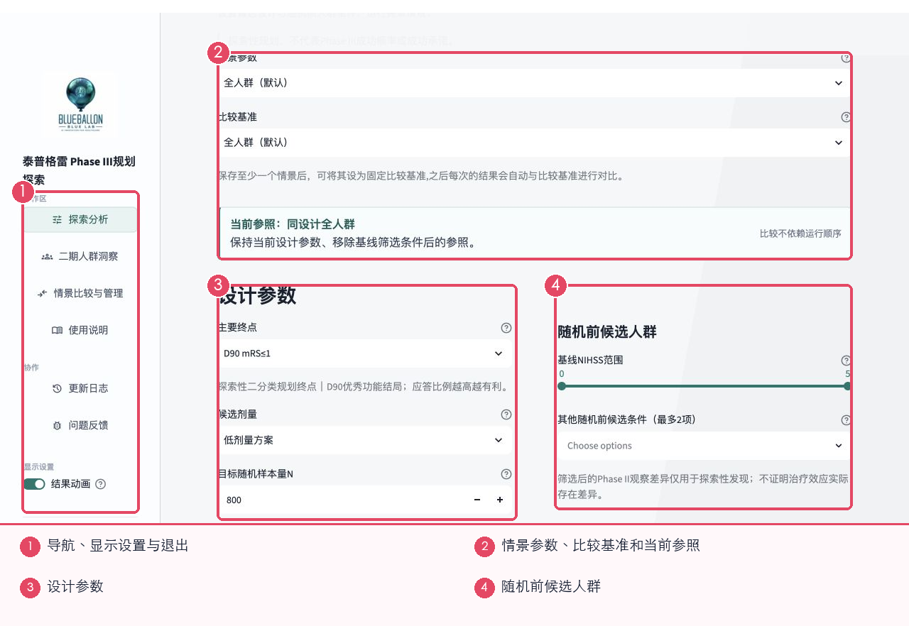

1. 探索分析：设置并运行候选设计。
2. 二期人群洞察：查看 Phase II 来源人数、原随机组构成和基线分布。
3. 情景比较与管理：选择已保存情景、下载比较报告、重命名、设为基准或删除。
4. 结果动画只影响显示效果；更新日志和问题反馈位于“协作”分组。

## 2. 选择主要终点

主要终点决定本次情景要回答什么问题。一次运行只能选择一个。

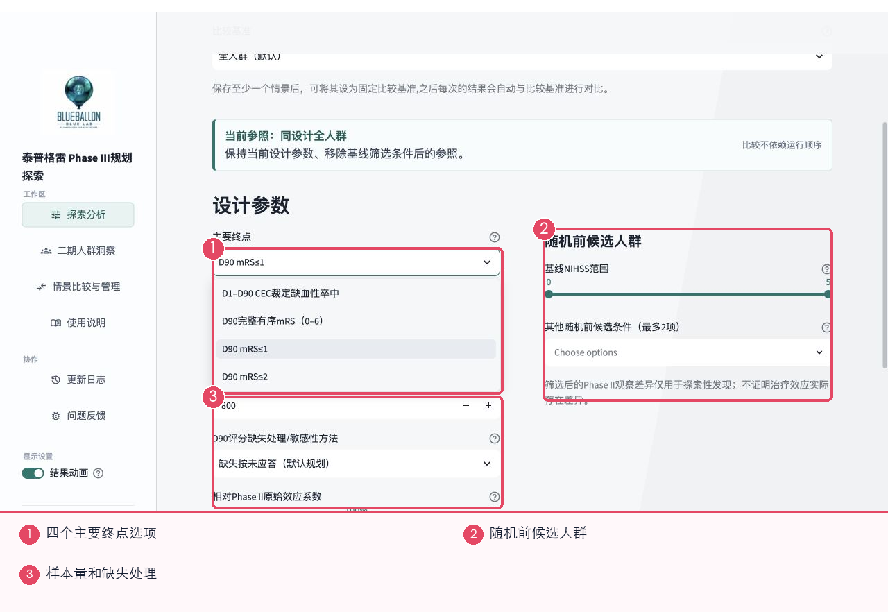

1. D1–D90 CEC 裁定缺血性卒中：关注 90 天内是否发生裁定的缺血性卒中；发生率越低越有利。
2. D90 完整有序 mRS（0–6）：关注 90 天功能结局整体向较轻等级移动；分值越低越好。
3. D90 mRS≤1：关注达到“无明显残疾或仅轻微症状”的比例；比例越高越有利。
4. D90 mRS≤2：关注达到“生活基本独立”的比例；比例越高越有利。
5. 不同终点回答的问题不同。混合比较只适合并列看设计情景，不应把百分比直接当作同一把尺子排序。

> 小提示：先根据拟议 Phase III 主要终点选择页面选项；不要为了让结果更高而临时更换终点。

## 3. 设置设计参数和候选人群

常用参数在首页直接显示；不常改的项目收在“高级设置”中。

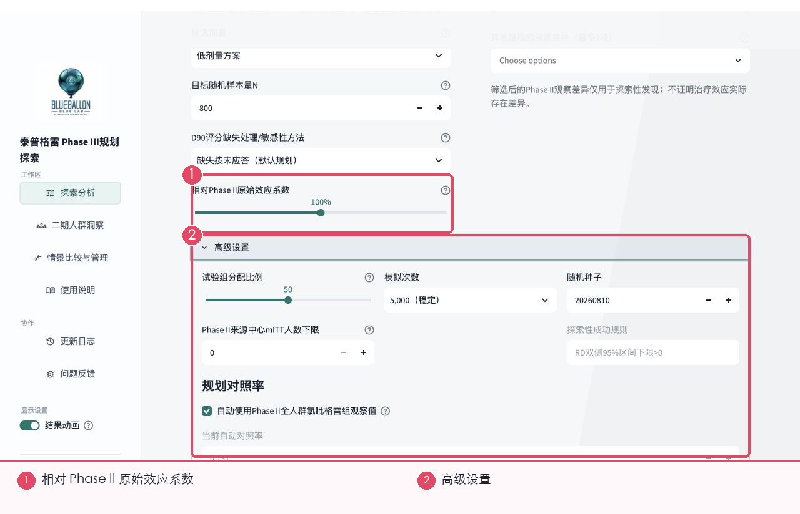

1. 候选剂量：选择低剂量或页面提供的其他剂量方案。
2. 目标随机样本量 N：计划最终随机入组的人数，不是预计筛查人数。
3. D90 评分缺失处理：只在 mRS 类终点中使用；按拟议方案口径选择。
4. 相对 Phase II 原始效应系数：100% 表示沿用当前 Phase II 观察到的差异；低于 100% 表示按更保守的差异规划；高于 100% 表示更乐观。
5. 基线 NIHSS 与最多两项其他条件描述随机前候选人群。条件越多，来源人数通常越少。
6. 高级设置可调整试验组比例、来源中心人数下限、运行次数、随机种子和规划对照率。一般使用者可保留默认值。

> 小提示：不确定高级设置时不要随意修改；先保存默认情景，再单独改变一项，便于比较。

## 4. 运行并阅读核心结果

检查参数提示后点“运行模拟”。运行结束后，页面会在下方显示核心结果卡片。

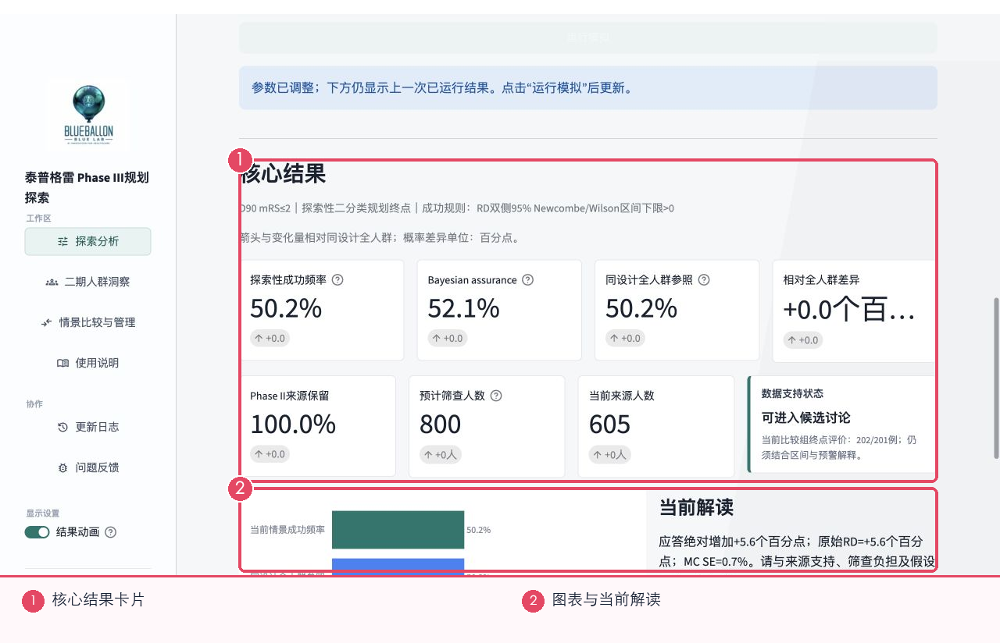

1. 探索性成功频率：在当前参数下，情景达到页面成功规则的频率。
2. Bayesian assurance：从另一种不确定性视角给出的成功参考值。普通使用者可把它和成功频率一起看；两者差异很大时应谨慎。
3. 同设计全人群参照：保持设计参数不变、移除候选人群筛选后的参照。
4. 相对全人群差异：当前筛选情景与全人群参照相差多少个百分点。
5. Phase II 来源保留、预计筛查人数和当前来源人数：帮助判断条件是否过严、筛查负担是否过大。
6. 数据支持状态：页面对当前来源人数是否足够的简短提示。它不是批准或停止项目的结论。

> 小提示：先看数据支持和筛查负担，再看成功频率；来源太少时，不要把高数值当作可靠优势。

## 5. 保存和下载当前情景

结果区下方可以保存情景，并导出三种格式。

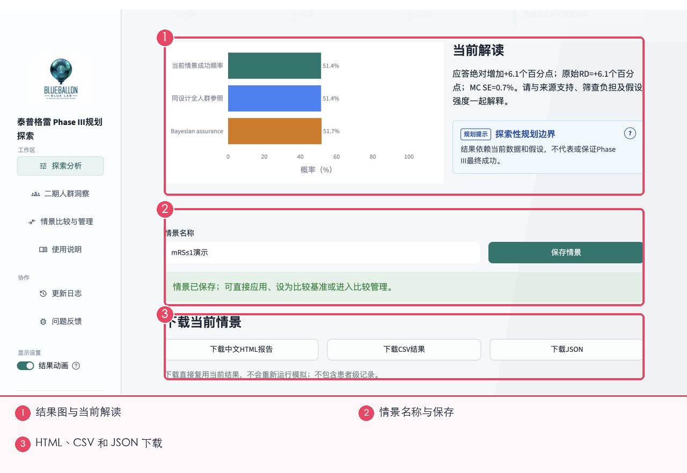

1. 情景名称：写明终点和关键变化，例如“mRS≤1_低剂量_N800”。
2. 保存情景：把当前已运行结果加入会话中的情景列表。修改参数后若未重新运行，页面会提示结果仍来自上一次运行。
3. 中文 HTML 报告：适合直接打开阅读或分享页面式汇总。
4. CSV：适合在 Excel 中查看主要数值。JSON：适合系统对接或留存完整结构。
5. 下载直接复用当前结果，不会重新运行，也不包含患者级记录。

## 6. 二期人群洞察：设置筛选

人群页可以独立查看来源数据，也可以按当前探索情景或已保存情景带入条件。

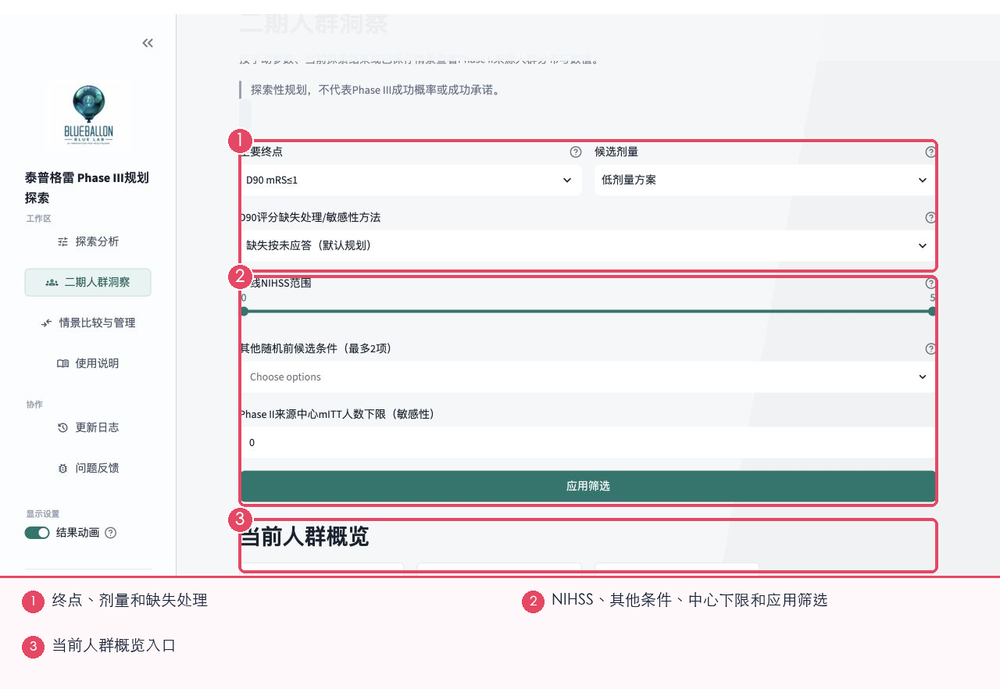

1. 主要终点和候选剂量决定页面显示哪组终点评价人数。
2. 基线 NIHSS 与其他随机前条件用于缩小候选人群。
3. 来源中心人数下限是敏感性查看条件，用来观察小中心记录对数据支持的影响；它不是自动生成的入组标准。
4. 修改条件后必须点“应用筛选”，下方人数和图表才会更新。

## 7. 二期人群洞察：阅读人数和图表

筛选结果先显示人数卡片，再显示筛选流程、原随机组构成和基线分布。

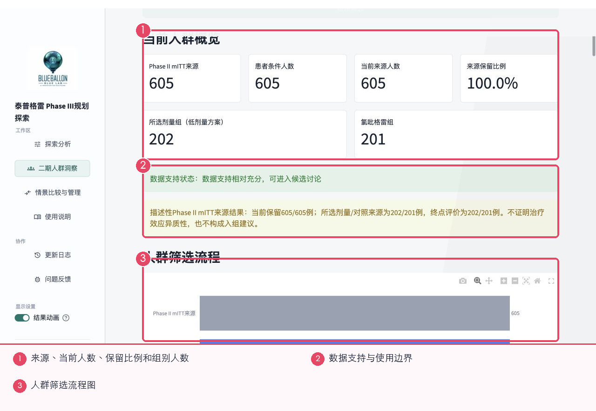

1. Phase II mITT 来源是起始人数；患者条件人数和当前来源人数显示筛选后还剩多少。
2. 所选剂量组和氯吡格雷组人数用于检查两组是否都有足够记录。
3. 来源保留比例越低，说明筛选越严格。绿色状态表示数据相对充分，黄色或红色提示需要更谨慎。
4. 页面下方还有 NIHSS、年龄、发病前 mRS、疾病/影像类型、病史、CYP2C19、SBP、中心规模和当前终点结局等分布图。
5. 可下载二期人群聚合数值 CSV；下载只含去标识化汇总值，不含患者明细。

## 8. 情景比较与管理

选择至少两个已保存情景后，页面会显示并列图表和管理按钮。

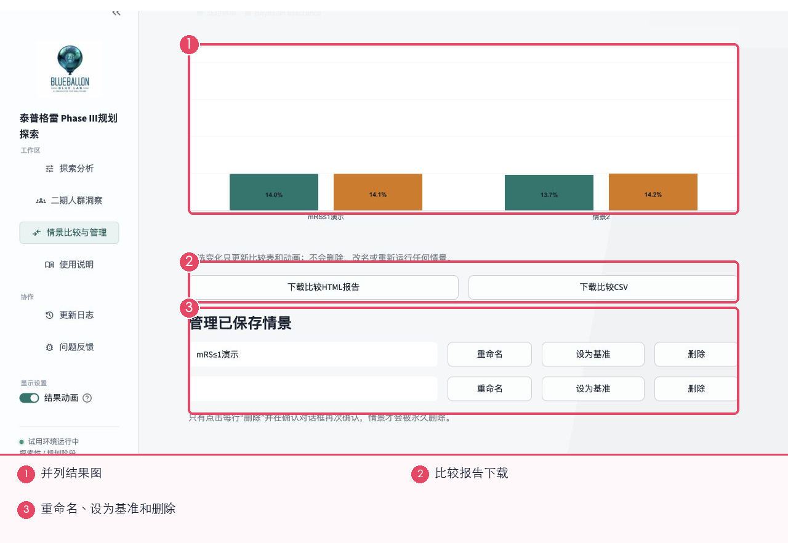

1. 选择参与比较的情景：只控制比较图和报告，不会删除未选择的情景。
2. 比较基准：设置以后运行和比较时使用的参照。
3. 下载比较 HTML/CSV：导出当前选择的情景。
4. 重命名不会重新运行；删除需要再次确认，确认后无法在当前会话恢复。
5. 若比较包含不同主要终点，页面会显示警告。此时只能并列查看，不能直接用高低判断哪个终点更好。

## 9. 内置使用说明和更新日志

网站内置页适合快速回顾流程；更新日志用于确认版本新增了什么。

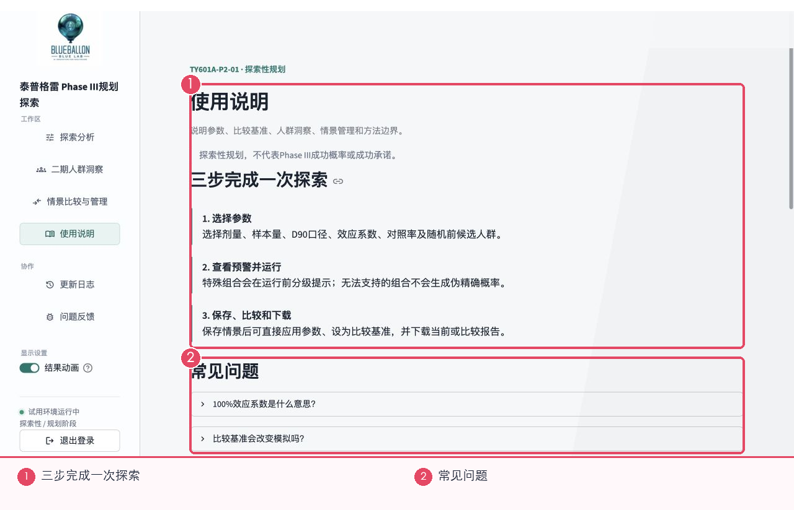

1. 三步说明覆盖选择参数、查看预警并运行、保存比较和下载。
2. 常见问题可展开查看效应系数、比较基准、情景删除、人群洞察和下载等说明。
3. 更新日志记录正式发布后的功能、数据或页面变化。看到新条目时，先确认它是否影响旧情景的读取方式。

## 10. 提交问题反馈

问题反馈支持文字、复现步骤和截图，提交前必须确认不含可识别个人信息。

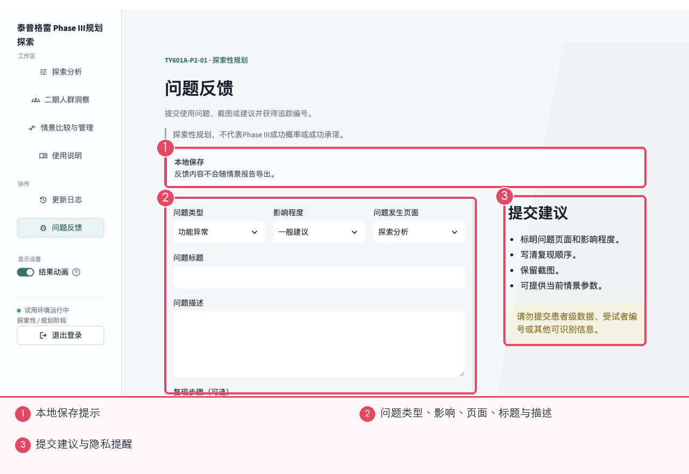

1. 选择问题类型、影响程度和发生页面；标题写清现象，描述写清实际结果和预期结果。
2. 复现步骤按 1、2、3 的顺序写，能帮助团队快速重现。联系邮箱可选。
3. 可上传不超过 5MB 的 PNG、JPG 或 WEBP 截图。截图前遮盖姓名、编号和其他个人信息。
4. “关联当前情景级参数与汇总结果”只附加情景级信息；仍需确认文字和截图不含可识别信息，才能提交。

> 小提示：如果问题阻断工作，请同时下载当前结果并记录页面、终点、参数和发生时间。

## 11. 查看版本变化

更新日志按日期列出重要功能变化。

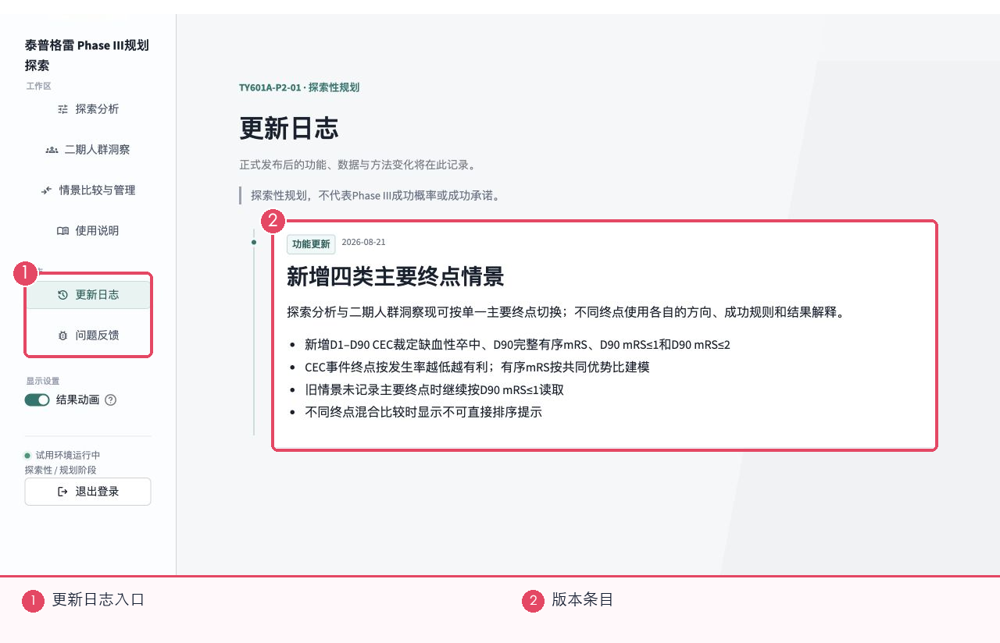

1. 当前示例条目说明新增了四类主要终点，并提示不同终点混合比较时不可直接排序。
2. 旧情景如果没有记录主要终点，页面会按日志中说明的默认方式读取。验收旧结果时应同时查看更新日期。

## 常见问题

### 为什么参数改了，结果没有立刻变？

页面会保留上一次已运行结果，并提示参数已调整。需要再次点击“运行模拟”才会更新。

### 四个主要终点能横向比较吗？

可以并列查看，但不同终点的方向和成功规则不同，不能把百分比直接当作同一标准排名。

### 为什么预计筛查人数突然升高？

候选人群条件变严格或来源保留比例下降时，需要筛查更多人才能达到目标随机样本量。

### 比较基准会改变模拟结果吗？

不会。它只改变参照和变化量的显示。

### 什么时候要改高级设置？

只有方案已有明确分配比例、运行稳定性或对照率要求时再改。没有明确要求时保留默认值。

## 建议的日常操作顺序

1. 先运行一个默认或全人群情景作为参照。
2. 每次只改变一个关键参数并重新运行。
3. 查看数据支持和人数，再看概率或成功频率。
4. 用清楚的名称保存重要情景，并及时下载。
5. 遇到异常时记录页面、参数、时间和截图，再提交反馈。

> 本手册只说明页面操作，不展开模型或试验方法。正式决策请结合项目方案、SAP、数据核查和专业评审。
