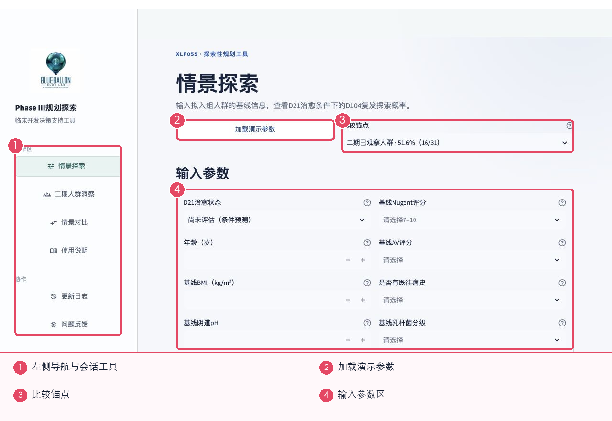
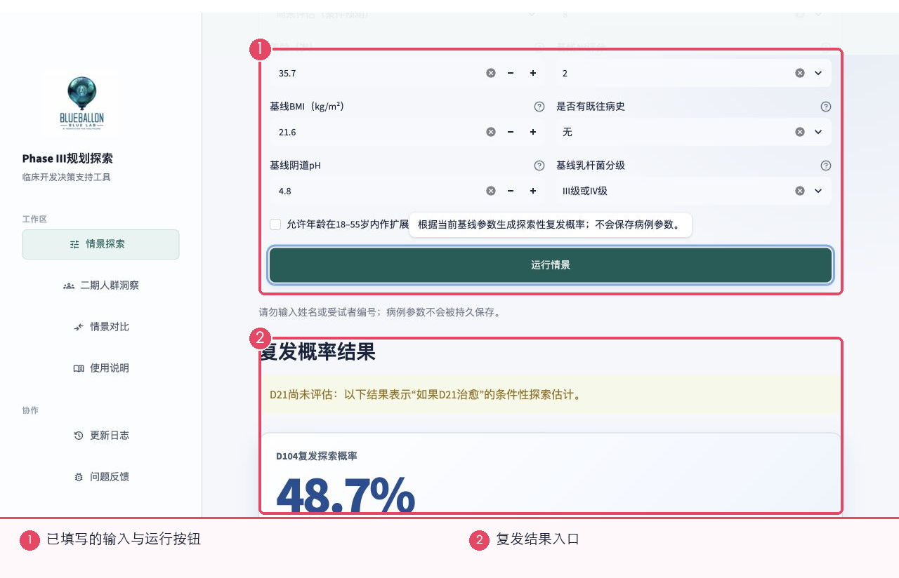
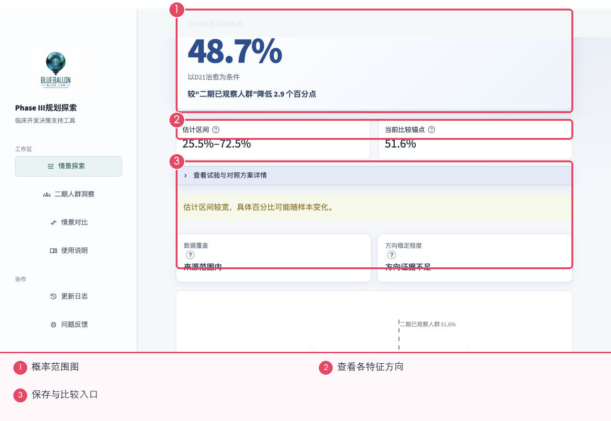
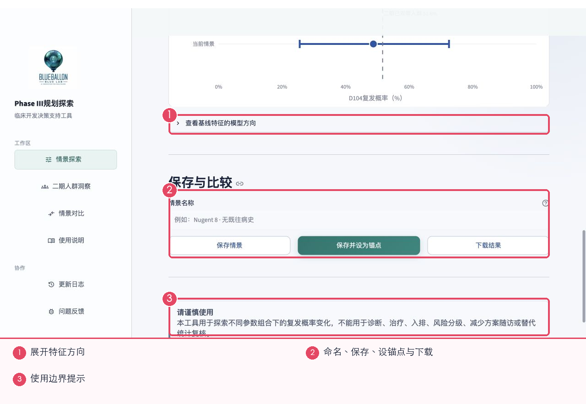
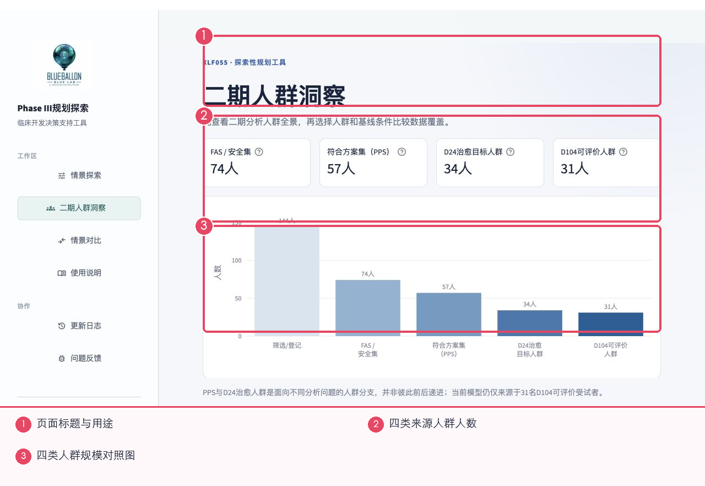
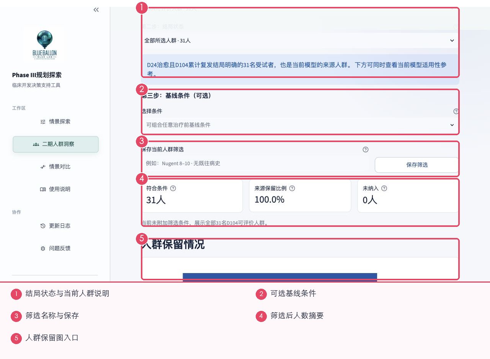
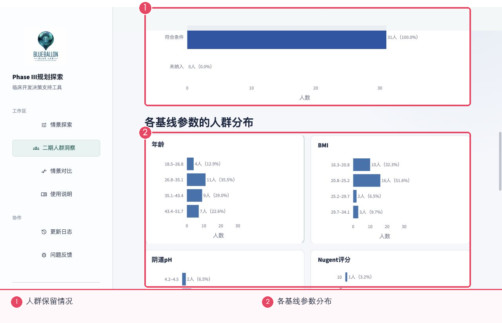
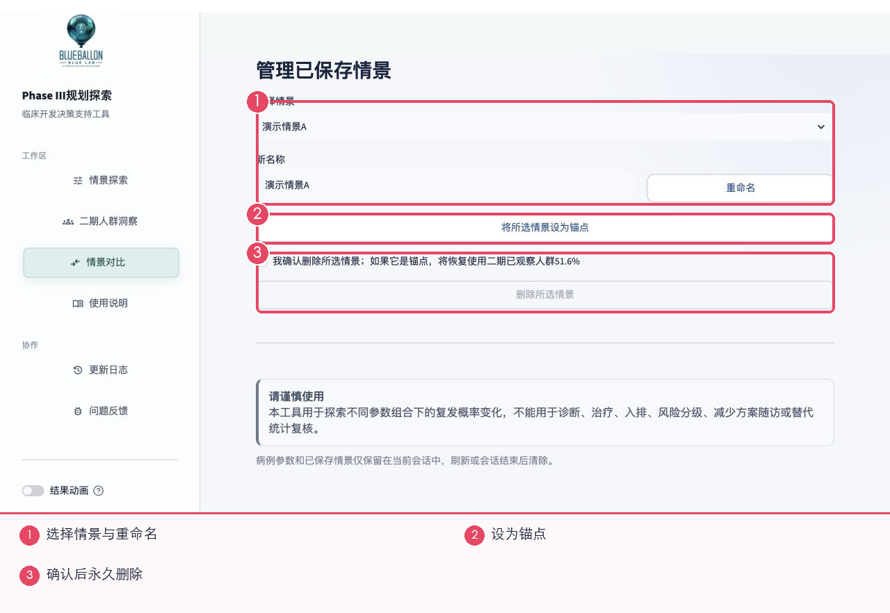
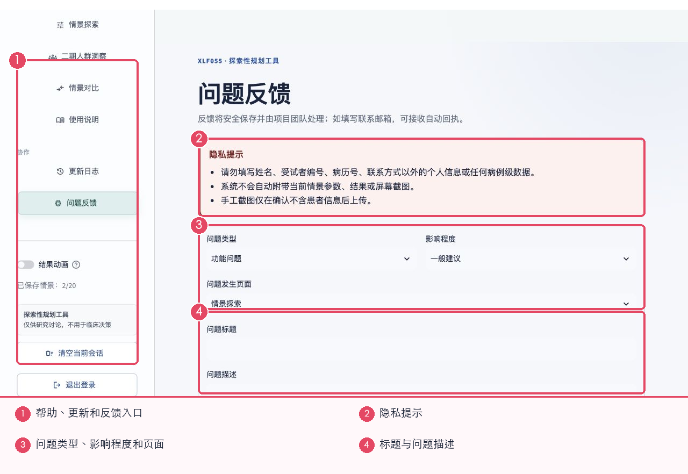

# XLF055 Phase III 规划探索工具｜网站使用说明

> 版本日期：2026-08-21 
> 适用范围：研究讨论与规划探索 
> 建议使用 Obsidian、Typora、VS Code 或其他 Markdown 阅读器打开。

适用于需要设置情景、查看复发探索结果、查看二期人群和比较已保存情景的使用者。

## 快速开始

1. 使用项目团队提供的网址打开登录页，输入分配给你的账号和密码。
2. 进入“情景探索”，可以先点“加载演示参数”熟悉页面，再按需要调整输入。
3. 点“运行情景”，先看结果值、范围和数据覆盖，再决定是否保存或下载。
4. 需要查看二期人数分布时进入“二期人群洞察”；需要并排查看已保存结果时进入“情景对比”。

## 使用前请注意

- 建议使用电脑浏览器，并把窗口尽量放大；截图以 1280×720 的页面宽度为例。
- 只输入假设参数，不要输入姓名、受试者编号、病历号或其他可识别个人的信息。
- 网站用于研究讨论。页面里的概率、人数和提示不能直接代替诊断、治疗、入排或正式统计复核。
- 情景和筛选主要保存在当前会话中。刷新、清空会话、退出或服务重启后，内容可能不再保留；重要结果请及时下载。

## 目录

- [1. 认识首页与导航](#1-认识首页与导航)
- [2. 设置情景并运行](#2-设置情景并运行)
- [3. 阅读复发探索结果](#3-阅读复发探索结果)
- [4. 保存、设为锚点和下载](#4-保存、设为锚点和下载)
- [5. 查看二期人群全景与筛选](#5-查看二期人群全景与筛选)
- [6. 选择人群、结局并保存筛选](#6-选择人群、结局并保存筛选)
- [7. 阅读人群分布图](#7-阅读人群分布图)
- [8. 情景对比与管理](#8-情景对比与管理)
- [9. 使用说明、更新日志与问题反馈](#9-使用说明、更新日志与问题反馈)
- [常见问题](#常见问题)

## 1. 认识首页与导航

登录后，左侧是固定导航，右侧是当前工作的页面。

1. 左侧导航：在情景探索、二期人群洞察、情景对比、使用说明、更新日志和问题反馈之间切换。
2. 加载演示参数：自动填入一组示例值，适合第一次使用时熟悉流程；它不会读取真实患者信息。
3. 比较锚点：指定本次结果要和哪个参照比较。更换锚点只改变比较对象，不会自动改动输入参数。
4. 结果动画只影响显示效果；关闭后不会改变结果。侧栏还可查看已保存情景数量、清空当前会话或退出登录。

> 小提示：第一次使用建议先加载演示参数并跑一次，再逐项改成自己的情景。

## 2. 设置情景并运行

输入区描述一位“假设受试者”的基线情况。填完后点页面下方的“运行情景”。

1. D21 治愈状态：选择是否已经知道 D21 结果。选择“尚未评估”时，页面会把结果写成“如果 D21 治愈”的条件性结果。
2. 可填写年龄、BMI、基线阴道 pH、Nugent 评分、AV 评分、既往病史和乳杆菌分级。空白项需要先补齐，页面才会计算。
3. “既往病史”按项目数据里的有/无标记填写，并不等同于只问妇科疾病。若无法确认含义，建议先不把它作为筛选条件，并向数据负责人核对。
4. “允许年龄在 18–55 岁内作扩展”仅用于探索范围外的假设值。勾选后要更谨慎解释页面提示。

> 小提示：运行前检查数字单位，尤其是 BMI、pH 和评分；不要把姓名或受试者编号写入任何输入框。

## 3. 阅读复发探索结果

结果区先给出最醒目的复发概率，再提供范围、参照和数据支持提示。

1. D104 复发探索概率：数值越高表示当前假设情景下的复发倾向越高。它是研究探索结果，不是某位患者的诊断。
2. 范围图：圆点是当前估计，横线表示结果可能波动的范围；范围越宽，解释时越要保守。
3. 比较锚点：虚线或对照文字代表当前参照。可以用它查看本情景相对参照是升高、降低还是接近。
4. “查看基线特征的模型方向”可展开各输入项对结果的大致方向。方向只用于帮助理解当前模型，不代表因果关系。

> 小提示：优先同时看“数值、范围、数据覆盖和方向稳定性”，不要只看一个百分比。

## 4. 保存、设为锚点和下载

运行成功后，可以给情景命名并保存，也可以把它作为以后比较时的固定参照。

1. 情景名称：建议写清关键差异，例如“D21治愈_年龄35_Nugent8”。
2. 保存情景：保留当前结果，之后可在情景对比页管理。
3. 保存并设为锚点：保存后立即把它作为新的比较参照。以后运行的情景会自动和它比较。
4. 下载结果：把当前汇总结果保存到本地。下载不会重新计算，也不会包含患者级记录。

> 小提示：侧栏显示当前会话可保存的数量。接近上限时，先下载重要结果，再删除不再需要的情景。

## 5. 查看二期人群全景与筛选

二期人群洞察先展示四类来源人群的规模，帮助使用者确认每类数据可以回答什么问题。

1. 页面顶部说明本页用于查看二期人群全景、选择人群并比较数据覆盖。
2. 人数卡片列出 FAS/安全集、PPS、D24 治愈目标人群和 D104 可评价人群。
3. 对照图用同一横轴展示四类人数，便于快速看出数据覆盖差异。
4. PPS 与 D24 治愈目标人群是面向不同问题的分支，并不是必须依次通过的两个步骤；当前复发模型来源仍以 D104 可评价人群为准。

> 小提示：先确认要回答的问题，再选择对应人群；不要因为某一类人数较多就自动认为它更适合所有分析。

## 6. 选择人群、结局并保存筛选

在人群全景下方，按三步选择分析人群、结局状态和可选的治疗前基线条件。

1. 第一步选择分析人群；第二步选择该人群中的结局状态。页面会在蓝色说明框中解释当前选择。
2. 第三步可以叠加治疗前基线条件。多项条件会同时生效，人数通常会继续减少。
3. 给筛选写一个清楚名称并点“保存筛选”，以后可重复使用同一组条件。保存筛选不会自动运行复发情景。
4. “符合条件”是筛选后人数；“来源保留比例”是保留了原人群的多少；“未纳入”是被条件排除的人数。
5. 页面下方的人群保留图和基线分布图会使用同一套当前筛选。

> 小提示：如果人数很少，页面仍会显示具体例数，方便筛查；使用时请避免结合其他信息反推个人身份。

## 7. 阅读人群分布图

应用筛选后，页面会用条形图展示保留情况及各项基线分布。

1. 条形长度表示人数多少，条形旁的数字是具体例数和占比。即使少于 5 例，也以实际例数显示。
2. 年龄、BMI、pH、Nugent 等图表使用同一套当前筛选条件。修改筛选并重新应用后，所有图表会一起更新。
3. 图表用于了解数据覆盖和分布，不会自动计算新的复发概率，也不能证明某个条件造成了结果变化。

> 小提示：先看保留人数，再看分布。人数过少时，优先把结论写成“数据不足以判断”。

## 8. 情景对比与管理

情景对比页管理当前会话中已保存的情景。取消选择不会删除情景。

1. 选择情景：切换要管理或比较的已保存情景。
2. 重命名：修改显示名称，不会重新运行，也不会改变结果。
3. 设为锚点：把所选情景作为后续比较参照。
4. 删除：必须先勾选确认，再点击删除。删除后当前会话里无法恢复，重要情景应先下载。

## 9. 使用说明、更新日志与问题反馈

网站内置简版帮助；本手册补充完整操作。更新日志用于确认版本变化，问题反馈用于提交建议或故障。

1. 使用说明：查看三步操作、常见问题和页面边界。打开说明不会运行模型。
2. 更新日志：查看正式发布后的功能或数据变化；没有记录时表示当前版本尚未写入发布条目。
3. 问题反馈：依次填写问题类型、影响程度、发生页面、标题和描述。写清复现步骤能帮助团队更快定位。
4. 反馈中不要写姓名、受试者编号、病历号或病例级数据。页面不会自动附上当前参数、结果或截图。

> 小提示：提交后如出现追踪编号，请保存编号；若页面提示未发送成功，先复制问题文字，再联系项目团队。

## 常见问题

### 为什么运行按钮不可用？

通常是必填项仍为空、数字超出允许范围，或选项组合暂不支持。回到输入区逐项检查页面提示。

### 锚点会改变当前结果吗？

不会。锚点只决定拿什么作比较；当前输入和计算结果不会因为换锚点而重新改变。

### 为什么筛选后人数很少？

多项条件会叠加缩小人群。逐项移除条件，观察是哪一项让人数明显下降。

### 刷新后保存情景不见了怎么办？

当前版本主要按会话保存。重要结果应在退出或刷新前下载；已经清空且没有下载的内容通常无法恢复。

## 建议的日常操作顺序

1. 先运行一个默认或全人群情景作为参照。
2. 每次只改变一个关键参数并重新运行。
3. 查看数据支持和人数，再看概率或成功频率。
4. 用清楚的名称保存重要情景，并及时下载。
5. 遇到异常时记录页面、参数、时间和截图，再提交反馈。

> 本手册只说明页面操作，不展开模型或试验方法。正式决策请结合项目方案、SAP、数据核查和专业评审。
